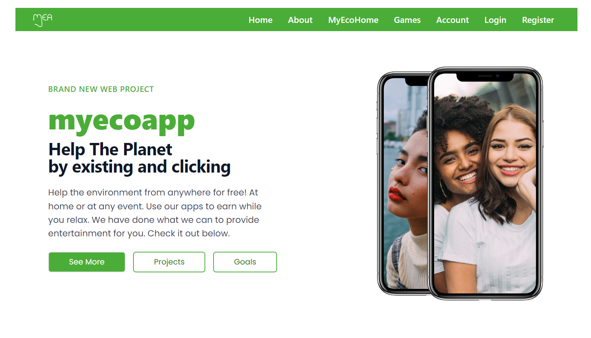
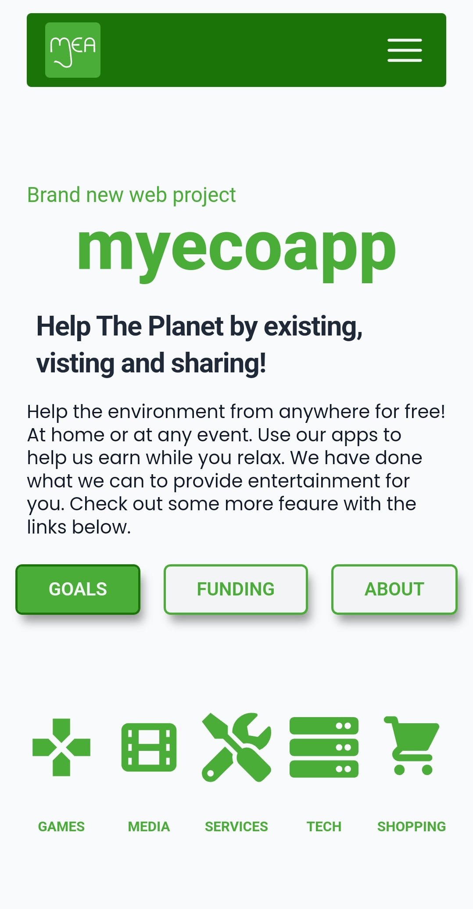

# myecoapp

A page be built for a group charity project to raise money for renewable energy using the internet as a platfrom.
Including Games, Services, Mailing Newsletters, Adverts, and Dontations.
Dislays a few issues and some short files.
The idea is to create a site that has a large amount of followers to make the advertising worth more.
The Frontend can be view at [myecoapp](https://dazzling-biscuit-b01617.netlify.app/)

## Home Page

## Table of contents

- [myecoapp](#myecoapp)
  - [Home Page](#home-page)
  - [Table of contents](#table-of-contents)
  - [General info](#general-info)
  - [Technologies](#technologies)
  - [Run this project locally](#run-this-project-locally)
  - [Design Information](#design-information)
  - [Current ERD](#current-erd)

## General info

Built using tailwing css styling.
Has a sign up feature currently working that user and vistors use to register to the mailing list.
Using a built in google search bar, users can make off site searches.
A lottery is being developed to help raise funds of the cause.

Paypal connection for donations - not launced yet still under dummy account.

Server deployment with Vercel @ [https://myecoapp-deploy.vercel.app/](https://myecoapp-deploy.vercel.app/)

## Technologies

App developed with:

Frontend: React, JavaScript, Tailwind, Axios, validator, react-native

Backend: Express, Prisma, JavaScript, express-handlebars

## Run this project locally

1. Fork this repository and clone the fork to your machine.
2. Navigate to client and server files and run
3. `npm install`
4. `npm start`

## Design Information

1. Link to ERD [ERD...](https://github.com/webdesignsbytom/webdesignsbytom-app/blob/main/assets/ERD-webdesignsbytom.png)
2. Original Design sketches [Sketch](https://github.com/webdesignsbytom/webdesignsbytom-app/tree/main/assets/design-sketches)
Phone version has tab options for each field

## Current ERD

